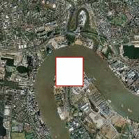
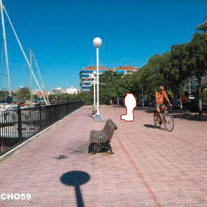

# Improved-inpaint-object-remover
Improved inpaint-object-remover method with structure tensor

This is the improved implementation method of the algorithm described in the paper "Region Filling and Object Removal by
Exemplar-Based Image Inpainting" by A. Criminisi et al.

## Setup
Requires python 3.5 or newer. You can download it [here](https://www.python.org/downloads/).

### Linux and Mac OS X
Get inside the project's directory, activate your conda environment(if it`s necessary) and run:
```
pip install -r requirements.txt
```
to install the dependencies.

### Windows
Recommend to use Anaconda to manage your virtual environments

After install this, inside the project's directory and activate your conda environment, run:
```
pip install -r requirements.txt
```
to install the other dependencies.

## How to use
Inside the project's directory run:
```
python __main__.py [-h] [-ps PATCH_SIZE] [-o OUTPUT] [-p] [-i INPUT_IMAGE] [-m MASK]
```
You can also pass the `-p` argument to watch the image being created. For example, use:
```
python __main__.py -i ../resources/image1.jpg -m ../resources/mask1.jpg
```
to process image1 inside resources folder using mask1 while printing each result. I provided some images from the paper inside the resources folder.

Use `python __main__.py -h` to show the available arguments.

## Performance

It proformance well on a small scale, however, with scale increasing, it gets worst.

Some reslut of repair:

result of image2

 

result of image3

 

result of image9



## Reference

An anvanced version of this programme has been posted on [here](https://github.com/Sunshine-0215/Improved-inpaint-object-remover), it performances better than before.

Ren S, Tang X H, Kang J L. Improved Criminisi algorithm with the texture and edge features[J]. Journal of Image and Graphics, 2012, 17(9): 1085–1091. [任澍, 唐向宏, 康佳伦. 利用纹理和边缘特征的Criminisi改进算法[J]. 中国图象图形学报, 2012, 17(9): 1085–1091. ] [DOI:10.11834/jig.20120906]

He Y T, Tang X H, Zhang Y, Yang R . Improved Criminisi algorithm based on structure tensor[J]. Journal of Image and Graphics, 2018, 23(10): 1492-1507. [何雨亭, 唐向宏, 张越, 杨瑞. 结构张量的改进Criminisi修复[J]. 中国图象图形学报, 2018, 23(10): 1492-1507.][DOI: 10.11834/jig.170650]

Criminisi A, Perez P, Toyama K. Region filling and object removal by exemplar-based image inpainting[J]. IEEE Transactions on Image Processing, 2004, 13(9): 1200–1212. [DOI:10.1109/TIP.2004.833105]
